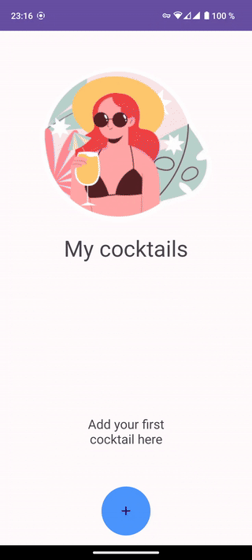
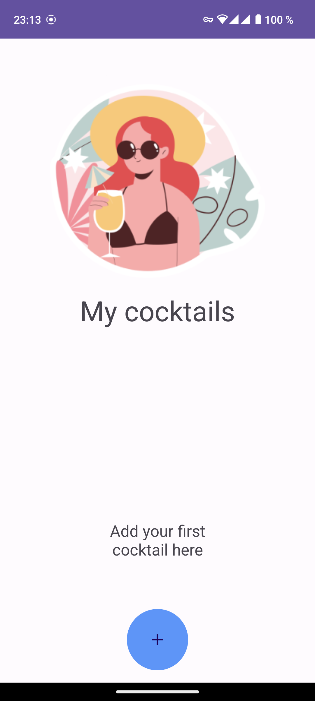
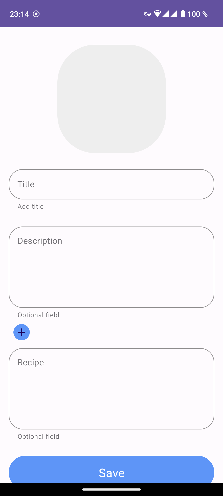
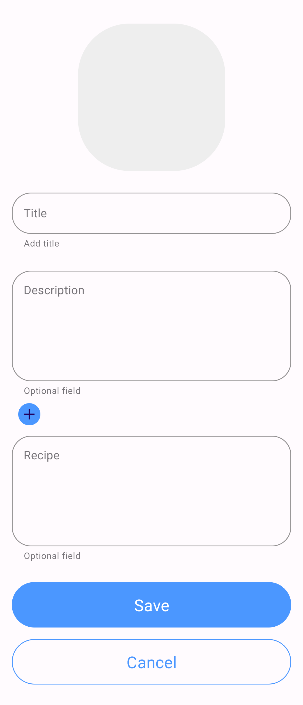
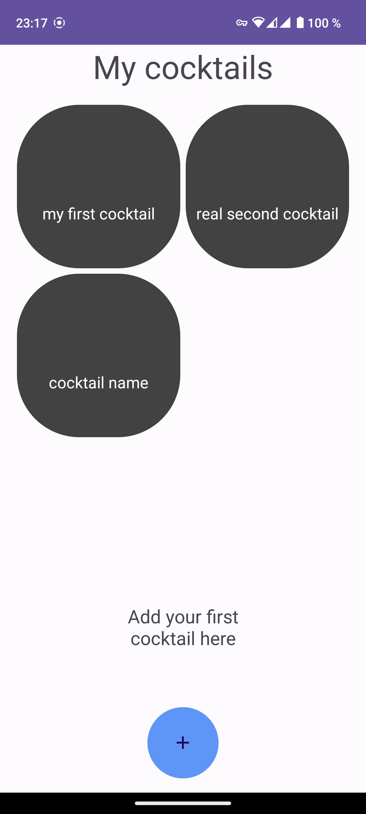

# Surf study jam project
Практическое задание для летней школы Surf

## Реализовано
- Экран "Мои коктейли"
- Экран добавления коктейля
- Сохранение коктейлей в базу данных

## Технологии
- Kotlin
- Architecture components
- MVVM
- Navigation
- Coroutines
- Room
- Dagger
- Recycler view
- View binding
- State Flow
- Material components
